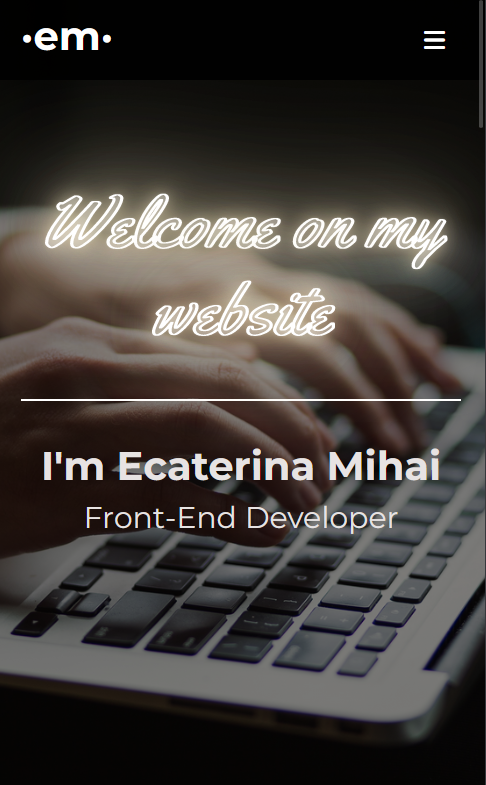
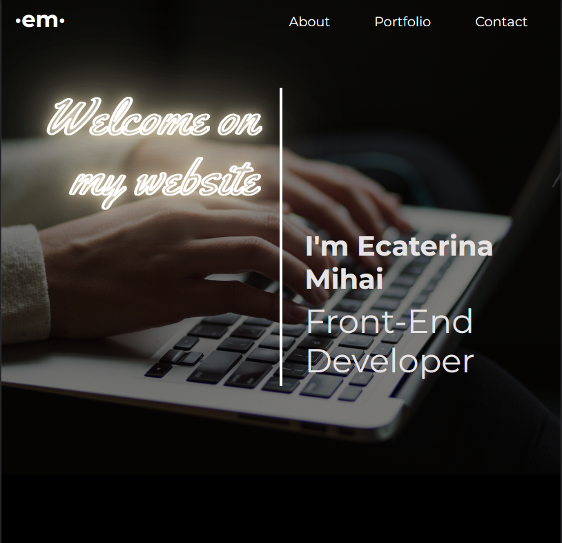
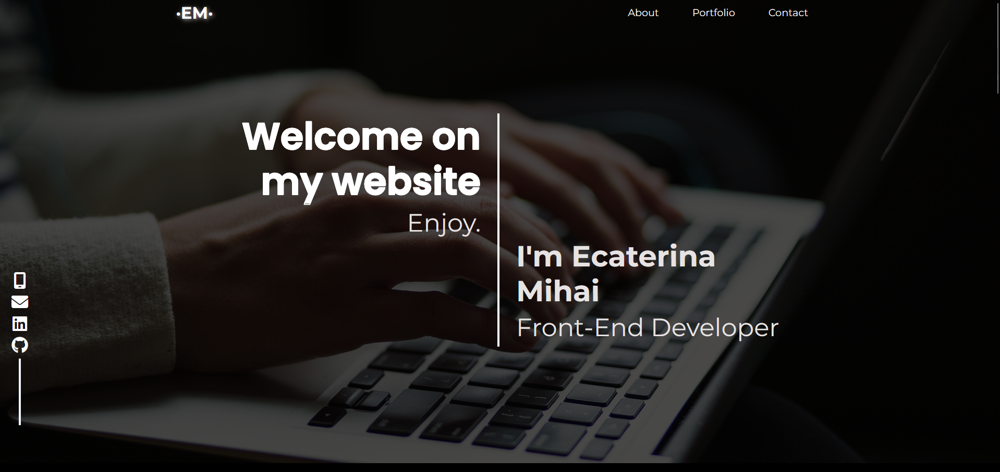

# Portfolio App

My very first project after I freshly graduated the Web Development Course at IT School.

## DEMO 

To view the project deployed on Netlify, please click on <a href='https://resume-project-me.netlify.app/' target='_blank'>Resume</a>.

## Table of contents

- [Overview](#overview)
  - [Preview](#preview)
- [The process](#my-process)
  - [Usage](#usage)
  - [Main Features](#main-features)
  - [Built with](#built-with)
  - [What I learned](#what-i-learned)
  - [Useful resources](#useful-resources)
- [Acknowledgments](#acknowledgments)

## Overview

### Preview 

This a short preview of the project's view on mobile, tablet and desktop devices.

| MOBILE SCREEN                                                  |              TABLET SCREEN                                       |
| -------------------------------------------------------------- | ---------------------------------------------------------------- |
|      |        |

DESKTOP SCREEN                                                             
:--------------------------------------------------------------------------:
|             |

## The process

### Usage 

This is a single page application news (SPA) where you can find a brief story about myself, my education and my work. 

### Main Features

- View information, skills and projects;
- Access contact for the opportunity of a new connection;

### Built with

- IDE (integrated development environment): VS Code; 
- JavaScript (ES6)
- REACT
- REACT Bootstrap
- Node.js , npm
- Bootstrap5
- CSS
- Netlify
- Git / GitHub

### What I learned

This project allowed me to increase my knowledge and abilities by applying key concepts like:

- creating a SPA in VS code by using Node.js, npm and react dependencies;
- responsive design for desktop, tablet and mobile screens by using React Bootstrap and Bootstrap5;
- JSX code modules in components and pages for better readability and debugging;
- CSS modules coresponding to components;
- deploying the project on Netlify by using Node.js, npm and Netlify;
- learning markdown language and creating a README.md document within informations about the project for the users ;

### Useful resources 

- [MDN](https://developer.mozilla.org/en-US/);
- [Markdown Guide](https://www.markdownguide.org/);
- [Codecademy](https://www.codecademy.com)

### Acknowledgments

- IT School;
- Codecademy;

(<a href="#readme-top">back to top</a>)

